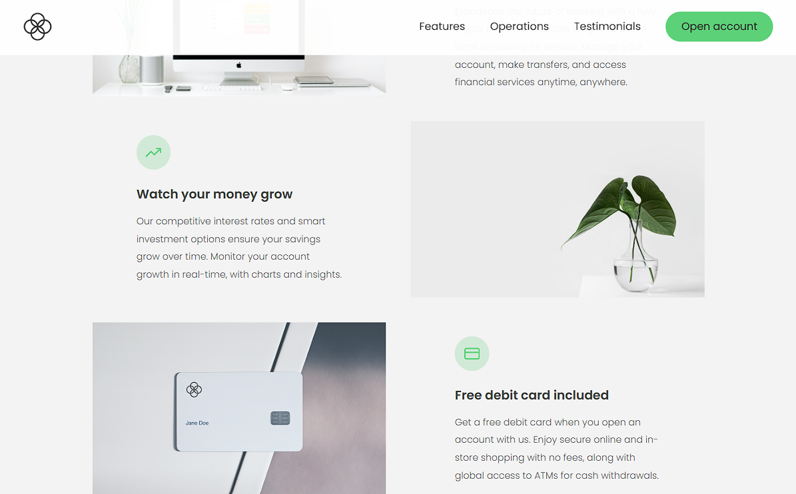
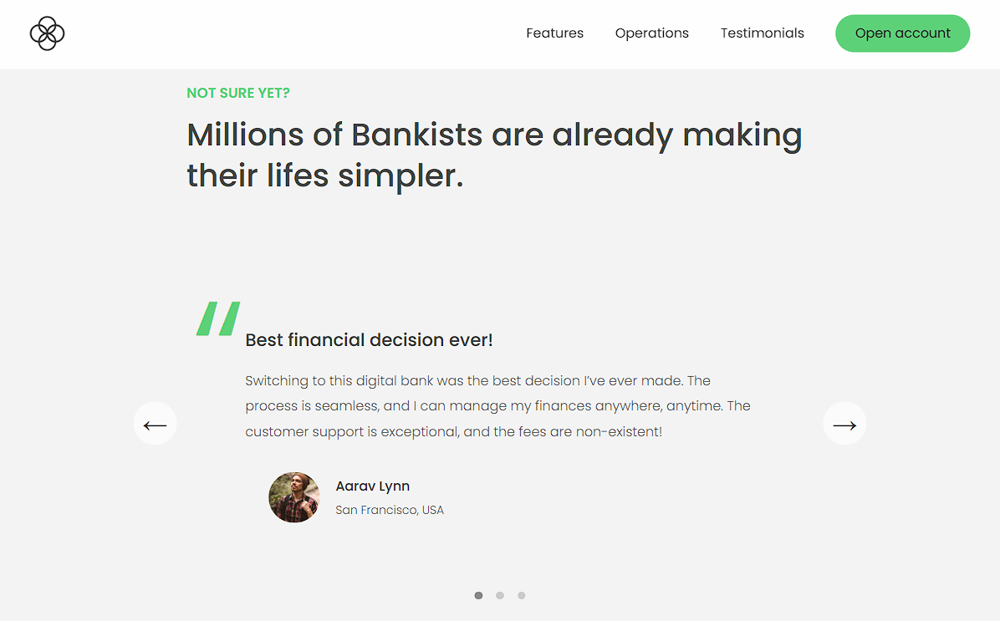
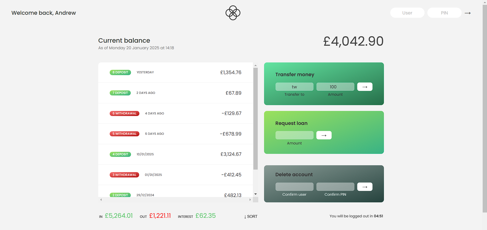

# Web Bank

Something like bank website for practicing JavaScript, DOM & Events.

# Visit Bank Website [Here 📌](https://wastardy.github.io/web_bank/)

## Website UI

---

## User Account UI

## Features

- **DOM manipulation, Event Handling**

- **Intersection Observer API**: Used the Intersection Observer API for sticky navigation, section reveal, and lazy loading.
  
- **Working with arrays**: Manipulation of arrays and using array methods like `map`, `filter`, `reduce` for managing account data and transactions.

- **Date handling with Intl**: Utilization of `Intl.DateTimeFormat` for displaying dates in a localized format for account transactions.

- **DOM manipulation and Events handling**: Dynamic DOM changes and event listeners based on user interactions.
  
- **Timers and Work with numbers**: Use of JavaScript timers like `setTimeout` and `setInterval` to manage automatic updates (e.g., account balances or timers for transactions). Formatting numbers (e.g., currency formatting) using `Intl.NumberFormat`,performing calculations, and handling different number formats.

- **Class `Date`**: Using the `Date` object to handle date and time calculations.